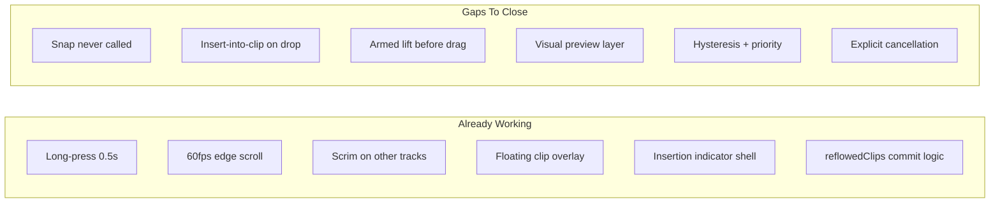
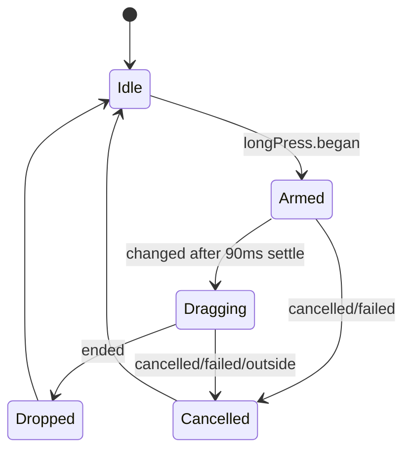

# Clip Drag Placement Refinement

## Design Principles

- **User mental model**: the user is *inserting* a clip; the timeline may split a destination clip as a consequence — not because the user chose "Split."
- **Data model stays real**: preview is a visual layer only. No temporary `MixrClip` objects, no fake UUIDs during drag.
- **Quiet preview, decisive drop**: during drag show insertion line + local displacement only; full ripple runs on drop.
- **Preview == commit algorithm**: `resolveClipDrop` is shared; preview reads its result visually, commit calls `applyClipDrop`.

## Current State vs. Required



---

## 1 — Placement API ([`Mixr/Models/MixrTimeline.swift`](Mixr/Models/MixrTimeline.swift))

### `ClipDropResult` naming

```swift
enum ClipDropResult: Equatable {
    /// Snap or free placement — ripple handled by reflowedClips on commit.
    case place(start: CGFloat)

    /// User inserted into the body of an existing clip; timeline splits it on commit.
    case insertIntoClip(
        targetClipID: UUID,
        splitUnit: CGFloat,        // where destination is cut
        insertStart: CGFloat       // dragged clip start (= splitUnit)
    )
}
```

### Resolution priority (strict order)

When resolving pointer position, evaluate in this order — **never insert into clip if an edge snap is available**, even when the pointer overlaps the clip body:

1. **Snap before** — pointer within snap zone of any clip's leading edge
2. **Snap after** — pointer within snap zone of any clip's trailing edge
3. **Insert into clip** — pointer in clip body, outside both edge zones
4. **Free place** — empty space; use raw proposed start (clamp ≥ 0)

Replace `resolvedClipInsertionStart` with:

```swift
resolveClipDrop(
    moving clipID: UUID,
    rawStart: CGFloat,
    pointerUnit: CGFloat,
    in clips: [MixrClip],
    snapZoneUnits: CGFloat,
    previousResult: ClipDropResult?   // for hysteresis
) -> ClipDropResult
```

### Snap zone + hysteresis constants ([`TLK`](Mixr/TimelineScreen.swift))

- `clipInsertionSnapZone`: **20 pt** (within user's 18–22 pt range; larger than current 14)
- `clipInsertionSnapHysteresis`: **8 pt** — once snapped to a target, require 8 pt movement away before switching to a different snap/insert state
- Store `lastResolvedResult` + `lastResolvedPointerUnit` on `ClipDragState`; pass `previousResult` into resolver

### Commit-only mutation

```swift
applyClipDrop(result: ClipDropResult, moving clipID: UUID, in clips: [MixrClip]) -> [MixrClip]
```

- `.place` → existing `reflowedClips(moving:to:in:)` (ripple on drop only)
- `.insertIntoClip` → split target at `splitUnit` into A1 + A2 (new UUID for A2), insert dragged clip between them, ripple suffix clips right; preserve transitions/metadata on all resulting clips via copy-from-source

**Only called from `commitClipDrop`** — never during drag.

---

## 2 — Visual Preview Layer (no fake model objects)

### `ClipRenderFrame` (file-level struct in [`TimelineScreen.swift`](Mixr/TimelineScreen.swift))

Computed visual descriptor — **not** stored in `tracks`:

```swift
struct ClipRenderFrame: Identifiable {
    let clipID: UUID           // always a real clip ID from the model
    var start: CGFloat         // visual x in timeline units
    var length: CGFloat
    var opacity: Double        // ghost = 0.28 for dragged source
    var isSourceGhost: Bool
    var isFloating: Bool       // true only for overlay copy
}
```

For **insert-into-clip preview**, the destination clip is rendered as **two visual frames** sharing the same `clipID` but with computed `start`/`length` — a rendering trick, not a model split:

```
BBBBBBBB  →  [BBB][gap][BBB]  →  [BBB][Dragged slot][BBB]
              insertPreviewProgress: 0 → 0.5 → 1.0
```

- `insertPreviewProgress: CGFloat` (0…1) on drag state, animated with spring when entering/leaving `.insertIntoClip`
- Gap width animates from 0 → dragged clip length
- Dragged clip ghost stays in floating overlay; lane shows opening gap beneath

### `resolveClipRenderFrames(...)`

Single function used by both preview rendering and (indirectly) drop indicator position:

```swift
MixrTimeline.resolveClipRenderFrames(
    moving: clipID,
    dropResult: ClipDropResult,
    insertPreviewProgress: CGFloat,
    in clips: [MixrClip]
) -> [ClipRenderFrame]
```

Rules during drag:
- **Do not call `reflowedClips`** — no full ripple preview
- Original clips keep model `start`/`length` except:
  - **Local neighbor shift**: immediate clip before/after insertion point offset ±10 pt (existing spring)
  - **Insert preview**: destination clip visually splits with animated gap (render-only)
- Dragged clip: ghost at original position + floating overlay copy

On drop: `applyClipDrop` mutates model once; spring animation settles frames to final positions.

---

## 3 — Armed State: Lift → Settle → Drag

### Gesture flow ([`TLClipMoveGestureBridge`](Mixr/TimelineScreen.swift))



**`TLClipMoveGestureBridge` changes:**
- `.began` → `onMoveArmed(clipID)` only (no position update)
- `.changed` → blocked until `armedSettleDeadline` (now + 90 ms); then `onMoveChanged`
- `.cancelled` / `.failed` → `onMoveCancelled`

**`TLTrackArea` states:**
- `@State clipDragArmed: UUID?` — lift phase, no cursor tracking yet
- `@State clipDragArmedAt: Date?` — settle timer anchor
- `@State isDraggingClip: Bool` — scrim visible during armed + dragging

**Armed visuals:**
- Floating clip at original position, lifted 6 pt, scale 1.05×, shadow/glow
- Insertion indicator at clip's current start
- Context toolbar hidden
- Scrim on non-active tracks
- Haptic on `.began`

**90 ms settle** (`TLK.clipDragArmedSettleDuration = 0.09`):
- Clip lifts in place
- After settle, first movement event begins cursor tracking
- Feels intentional: lift… then follow

---

## 4 — Preview During Drag (quiet)

| Signal | During drag | On drop |
|--------|-------------|---------|
| Insertion indicator | Always visible at resolved start | — |
| Neighbor shift | ±10 pt on immediate neighbors only | — |
| Full ripple | **No** | Yes via `applyClipDrop` |
| Split preview | Animated gap in destination clip | Real split in model |
| Floating clip | Follows cursor freely | Springs to final start |

### Insert-into-clip animation

When `dropResult` transitions to `.insertIntoClip`:

1. `insertPreviewProgress` animates 0 → 1 over ~200 ms (spring)
2. Destination clip visually separates: leading portion slides left, trailing portion slides right, gap opens to dragged clip width
3. Insertion indicator sits in the gap center
4. On leaving insert zone: progress animates back to 0 (gap closes)

This replaces instant `B1 | Dragged | B2` rendering.

---

## 5 — Cancellation (explicit)

Cancel triggers — **no model mutation in any case**:

- Long press `.cancelled` / `.failed`
- Finger released during armed phase (before settle completes) → cancel
- Drag ended outside timeline bounds (optional: Y outside track area ± margin)
- Future: Esc key (skip for V1 unless trivial via iOS key command)

**`cancelClipDrag()` behavior:**
```swift
clipDragScrollTask?.cancel()
withAnimation(.spring(response: 0.32, dampingFraction: 0.82)) {
    clipDragState  = nil
    clipDragArmed  = nil
    isDraggingClip = false
    // selectedClipID unchanged — clip stays selected
    // activeGrip unchanged
}
// Context toolbar reappears automatically (!isDraggingClip guard)
// Scrim fades out (existing 130 ms ease-out)
```

Floating clip springs back to original lane position before disappearing.

---

## 6 — `ClipDragState` updates

Remove `resolvedStart` stub. Add:

- `lastDropResult: ClipDropResult?` — hysteresis anchor
- `insertPreviewProgress: CGFloat` — split animation driver
- `func resolveDropResult(contentUnits:contentW:clips:) -> ClipDropResult` — calls `MixrTimeline.resolveClipDrop` with snap zone + hysteresis
- `func insertionStart(from result: ClipDropResult) -> CGFloat` — indicator source of truth

**No `splitPreviewID`** — preview uses render frames, not fake clips.

---

## 7 — `TLTrackLane` rendering

```swift
// ForEach still iterates real track.clips — model unchanged during drag
ForEach(track.clips) { clip in
    let frame = renderFrame(for: clip.id, frames: previewFrames)
    // position from frame.start / frame.length
    // opacity from frame.opacity
}
```

`previewFrames` computed each render from `resolveClipRenderFrames` — never written back to `tracks`.

Insert-into-clip: destination clip draws **two** `WaveformClip` sub-rects from one `clipID` using split geometry derived from `insertPreviewProgress`. No second UUID.

---

## 8 — Constants summary ([`TLK`](Mixr/TimelineScreen.swift))

| Constant | Value |
|----------|-------|
| `clipDragLongPressDuration` | 0.50 s (existing) |
| `clipDragArmedSettleDuration` | 0.09 s (new) |
| `clipDragLiftScale` | 1.05 (existing) |
| `clipDragLiftY` | 6 pt (existing) |
| `clipInsertionSnapZone` | 20 pt (was 14) |
| `clipInsertionSnapHysteresis` | 8 pt (new) |
| `clipDragNeighborShift` | 10 pt local only (existing) |
| `clipInsertPreviewResponse` | ~0.22 s spring (new) |

---

## File Summary

| File | Changes |
|------|---------|
| [`Mixr/Models/MixrTimeline.swift`](Mixr/Models/MixrTimeline.swift) | `ClipDropResult`, `resolveClipDrop` (priority + hysteresis), `applyClipDrop`, `resolveClipRenderFrames`; remove unused `resolvedClipInsertionStart` |
| [`Mixr/TimelineScreen.swift`](Mixr/TimelineScreen.swift) | `ClipRenderFrame`, armed/settle/cancel states, preview rendering in `TLTrackLane`, insert animation, updated overlays |

No new dependencies. No UI component redesign.

## Verification Checklist

- Tap selects; short drag scrolls timeline; long press arms lift
- After 90 ms settle, clip follows cursor; scrim + toolbar hide
- Insertion indicator snaps with 20 pt zones; no flicker (8 pt hysteresis)
- Edge snap wins over insert-into-clip even when pointer overlaps clip body
- Drag over clip middle: animated gap opens; no full ripple during drag
- Drop: model mutates once via `applyClipDrop`; spring settle; playhead → clip start
- Cancel: spring back, scrim out, toolbar returns, zero model changes
- Preview positions match final drop result for all three modes (before / after / insert)
