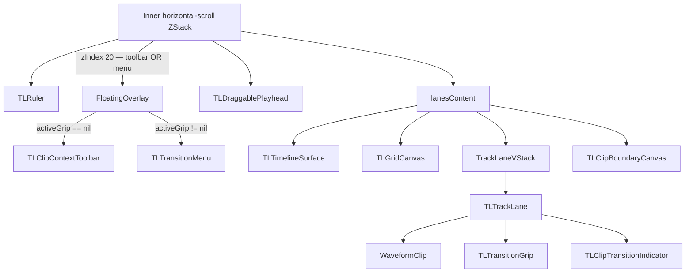

# Clip Editing UI — Implementation Plan (Revised)

## Codebase Snapshot

Starting from clean reverted state:
- `MixrClip` — `id`, `start`, `length` only (no transitions)
- `TLTrackLane` — renders `WaveformClip` per clip, no gestures, no selection state
- `lanesContent` — `ZStack`: surface → grid → `VStack` of `TLTrackLane` → `TLClipBoundaryCanvas`
- Inner horizontal-scroll `ZStack` (`TLTrackArea.body`) — ruler + `lanesContent` + `TLDraggablePlayhead`
- `TLDraggablePlayhead` — `DragGesture(minimumDistance:0, coordinateSpace:.named("phContent"))`, 44 pt hit strip; **untouched**
- `GlassBackground` / `GlassLevel.strong` — existing premium glass system used for panels
- `EffectCard` icon boxes — dark glass rounded-rect with icon; transition icon boxes match this language

---

## Component Architecture



**Mutual exclusion** is structural: `TLClipContextToolbar` is only rendered when `activeGrip == nil`; `TLTransitionMenu` only when `activeGrip != nil`. Both share `zIndex(20)` — only one is ever present.

---

## Files Changed

| File | Change |
|------|--------|
| [`Mixr/Models/MixrTrack.swift`](Mixr/Models/MixrTrack.swift) | Add `ClipTransitionType`, `ClipTransition` struct, `GripSide`, `ActiveGrip`; extend `MixrClip` |
| [`Mixr/DesignSystem/ClipEditingUI.swift`](Mixr/DesignSystem/ClipEditingUI.swift) | **New** — all clip editing components |
| [`Mixr/TimelineScreen.swift`](Mixr/TimelineScreen.swift) | State + helpers in `TLTrackArea`; updated `TLTrackLane`; updated `lanesContent`; overlays in inner ZStack |

Unchanged: transport bar, playback engine, effects panel, sidebar, S/M panel, import logic, `TLDraggablePlayhead`, waveform color system, scroll behavior.

---

## 1. Future-Proof Model (`MixrTrack.swift`)

### `ClipTransitionType` enum

```swift
enum ClipTransitionType: String, CaseIterable, Equatable, Sendable, Identifiable {
    case none      = "None / Hard Cut"
    case crossfade = "Crossfade"
    case fadeOut   = "Fade Out"
    case echoOut   = "Echo Out"
    case auto      = "Auto"

    var id: Self { self }
}
```

### `ClipTransition` struct — extensible, not a raw enum

```swift
struct ClipTransition: Equatable, Sendable {
    var type:     ClipTransitionType = .none
    var duration: Double = 0.5     // seconds — reserved, not exposed in Phase 1
    var strength: Double = 1.0     // 0–1 intensity — reserved
    var curve:    String = "linear" // easing label — reserved

    static let none = ClipTransition()
}
```

All existing call sites default to `.none`. Later phases add duration/strength sliders without touching `MixrClip`.

### `MixrClip` extension

```swift
struct MixrClip: Identifiable {
    let id: UUID
    var start:         CGFloat
    var length:        CGFloat
    var transitionIn:  ClipTransition = .none
    var transitionOut: ClipTransition = .none
}
```

### Grip types (shared between `ClipEditingUI.swift` and `TimelineScreen.swift`)

```swift
enum GripSide: Equatable {
    case leading   // Transition In
    case trailing  // Transition Out
}

struct ActiveGrip: Equatable {
    let clipID:  UUID
    let trackID: UUID
    let side:    GripSide
}
```

---

## 2. New File: `ClipEditingUI.swift`

All types `internal` (accessible from `TimelineScreen.swift`).

### a. `TLClipEditingMetrics`

```swift
enum TLClipEditingMetrics {
    static let toolbarWidth:       CGFloat = 162
    static let toolbarBodyHeight:  CGFloat = 46
    static let toolbarPointerW:    CGFloat = 12
    static let toolbarPointerH:    CGFloat = 7
    static let menuWidth:          CGFloat = 176
    static let menuRowHeight:      CGFloat = 40
    static let iconBoxSize:        CGFloat = 26
    static let iconBoxRadius:      CGFloat = 7
    static let gripVisual:         CGFloat = 11
    static let gripHit:            CGFloat = 32    // min 32 pt touch target
    static let indicatorSize:      CGFloat = 20
}
```

### b. `TLClipActionPressStyle: ButtonStyle`

Physical press: whole cell shifts down and darkens. No icon-only scale.

```swift
struct TLClipActionPressStyle: ButtonStyle {
    func makeBody(configuration: Configuration) -> some View {
        configuration.label
            .offset(y: configuration.isPressed ? 1.5 : 0)
            .background {
                if configuration.isPressed {
                    Color.black.opacity(0.20)
                }
            }
            .animation(.spring(response: 0.18, dampingFraction: 0.85),
                       value: configuration.isPressed)
    }
}
```

### c. `TLTransitionIconBox`

Matches `EffectCard` glass language. Used in both menu rows and boundary indicators.

- **Default state:** `glassNavyStrong` fill ~0.52 opacity + `ultraThinMaterial` ~0.06 + white border 7% + top-edge rim highlight gradient (white 9% → clear over top 30%)
- **Highlighted state:** track-color fill 22% + track-color border 48% + soft color glow (radius 6)
- Icon: white when default, track color when highlighted

```swift
struct TLTransitionIconBox: View {
    let transitionType: ClipTransitionType
    var highlighted: Bool = false
    var trackColor: Color = .white
    // ...
}
```

### d. `TLTransitionGrip` — four visual states

The grip always has a black center and white ring. Color only appears as a halo outside the ring, never replacing the center.

| State | Visual |
|-------|--------|
| **Default** | Black center Ø6, white ring Ø11, faint white glow blur |
| **Hover** | Same + ring brightens to 100% opacity + scale 1.08 |
| **Pressed** | Same center/ring + slight compression (scale 0.94) + increased white glow |
| **Active/Applied** | Same center/ring + track-color halo stroke Ø17 (0.55 opacity) + blurred track-color outer bloom Ø22 (0.20 opacity) |

Implementation: `@GestureState private var isHovered` via `DragGesture(minimumDistance:0)` `.updating` for press detection; `isActive` / `hasTransition` passed as props.

Hit target: 32×32 pt invisible `contentShape(Rectangle())` centered on grip. Visual lives inside without expanding hit area.

### e. `TLClipContextToolbar`

Visual spec:
- Background: `GlassBackground(level: .strong, cornerRadius: 10)` — `.strong` uses `glassNavyStrong` at 0.42 tint + 0.12 material, giving needed opacity
- Add extra opaque black layer on top: `Color(hex:"050810").opacity(0.28)` to push it darker than `.strong` alone
- Top-edge glass shine: `LinearGradient` white 9%→0% over first 2pt
- Three cells separated by `MixrColors.divider` hairlines
- All icons/labels **white** — Delete is not red
- `TLClipActionPressStyle` on every cell
- Downward pointer triangle below using `TLToolbarPointer` shape
- `zIndex(20)`

```
Width: 162 pt | Cell height: 46 pt | Pointer: 12×7 pt
Total height: 53 pt
```

### f. `TLTransitionMenu`

Visual spec:
- Same dark glass background as toolbar
- Header row: "Transition In" / "Transition Out", 11 pt semibold, textSecondary color
- Five rows, compact 40 pt height
- Row layout: `TLTransitionIconBox(size:26)` + label 12pt regular + Spacer + optional checkmark
- **Selected row:** icon box highlighted + bold label weight + track-color checkmark
- All labels white (no tinting), only icon box changes color
- `TLClipActionPressStyle` on every row
- `zIndex(20)` (shares slot with toolbar — mutually exclusive)

### g. `TLClipTransitionIndicator`

Applied at clip boundary after transition is set:
- Uses `TLTransitionIconBox(size: 20, highlighted: true)` — same glass language as menu
- Positioned half-overlapping the clip top edge at the boundary (`y = -indicatorSize/2`)
- Centered on the clip edge X coordinate
- Only visible when `transition.type != .none`

---

## 3. State Management (`TLTrackArea`)

```swift
// Clip editing state
@State private var selectedClipID:  UUID?       = nil
@State private var clipTapAnchorX:  CGFloat?    = nil
@State private var activeGrip:      ActiveGrip? = nil
```

### Mutual exclusion rules (enforced in each transition):

| Action | selectedClipID | activeGrip | clipTapAnchorX |
|--------|---------------|------------|----------------|
| Tap clip | set to clipID | set to nil | set to tapX |
| Tap grip | unchanged | set to grip | unchanged |
| Tap different clip | set to new clipID | set to nil | set to new tapX |
| Tap outside | nil | nil | nil |
| Select transition | unchanged | set to nil | unchanged |
| Toolbar action completes | nil or new | nil | nil |

**Toolbar is shown when:** `selectedClipID != nil && activeGrip == nil`
**Menu is shown when:** `activeGrip != nil`
These conditions are mutually exclusive by construction — no guard needed at render.

### Helper

```swift
private struct FoundClip {
    let trackIdx: Int
    let clipIdx:  Int
    let track:    MixrTrack
    let clip:     MixrClip
}
private func findClip(_ id: UUID) -> FoundClip? {
    for (ti, track) in tracks.enumerated() {
        if let ci = track.clips.firstIndex(where: { $0.id == id }) {
            return FoundClip(trackIdx: ti, clipIdx: ci, track: track, clip: track.clips[ci])
        }
    }
    return nil
}
```

---

## 4. Clip Mutation Methods

All mutations use `.spring(response: 0.25, dampingFraction: 0.85)`.

### Split

```swift
func splitClip(id: UUID) {
    guard let f = findClip(id) else { return }
    let phUnit  = effectivePlayheadUnit
    let inClip  = phUnit > f.clip.start && phUnit < f.clip.start + f.clip.length
    let splitAt = inClip ? phUnit : f.clip.start + f.clip.length / 2
    guard splitAt - f.clip.start >= 2,
          f.clip.start + f.clip.length - splitAt >= 2 else { return }

    let leftLen  = splitAt - f.clip.start
    let rightLen = f.clip.length - leftLen
    let newID    = UUID()

    tracks[f.trackIdx].clips[f.clipIdx].length = leftLen
    tracks[f.trackIdx].clips[f.clipIdx].transitionOut = .none
    tracks[f.trackIdx].clips.insert(
        MixrClip(id: newID, start: splitAt, length: rightLen),
        at: f.clipIdx + 1
    )
    withAnimation(.spring(response: 0.25, dampingFraction: 0.85)) {
        selectedClipID = newID; activeGrip = nil; clipTapAnchorX = splitAt / TLK.totalUnits * contentW
    }
}
```

(`contentW` is captured from the outer `GeometryReader` and stored as a `@State` property set in `body`.)

### Duplicate

```swift
func duplicateClip(id: UUID) {
    guard let f = findClip(id) else { return }
    let newStart = f.clip.start + f.clip.length
    guard newStart < TLK.totalUnits else { return }
    let newLen = min(f.clip.length, TLK.totalUnits - newStart)
    let newID  = UUID()
    tracks[f.trackIdx].clips.insert(
        MixrClip(id: newID, start: newStart, length: newLen),
        at: f.clipIdx + 1
    )
    withAnimation(.spring(response: 0.25, dampingFraction: 0.85)) {
        selectedClipID = newID; activeGrip = nil
        clipTapAnchorX = (newStart + newLen * 0.2) / TLK.totalUnits * contentW
    }
}
```

### Delete

```swift
func deleteClip(id: UUID) {
    guard let f = findClip(id) else { return }
    withAnimation(.spring(response: 0.25, dampingFraction: 0.85)) {
        tracks[f.trackIdx].clips.remove(at: f.clipIdx)
        selectedClipID = nil; activeGrip = nil; clipTapAnchorX = nil
        // Track row is preserved even with zero clips
    }
}
```

### Set transition

```swift
func setTransition(type: ClipTransitionType, grip: ActiveGrip) {
    guard let f = findClip(grip.clipID) else { return }
    var tx = ClipTransition()
    tx.type = type
    if grip.side == .leading  { tracks[f.trackIdx].clips[f.clipIdx].transitionIn  = tx }
    else                       { tracks[f.trackIdx].clips[f.clipIdx].transitionOut = tx }
    withAnimation(.spring(response: 0.25, dampingFraction: 0.85)) { activeGrip = nil }
}
```

---

## 5. Selection Glow — `TLTrackLane`

Selected clip uses **three stacked effects** for sufficient elevation:

```swift
WaveformClip(...)
    .overlay {
        if isSel {
            // Bright colored stroke border
            RoundedRectangle(cornerRadius: 5, style: .continuous)
                .strokeBorder(track.color.color.opacity(0.92), lineWidth: 2.0)
            // Subtle inner white catch-light
            RoundedRectangle(cornerRadius: 5, style: .continuous)
                .strokeBorder(Color.white.opacity(0.07), lineWidth: 0.5)
                .padding(1.5)
        }
    }
// Tight colored glow — close to clip surface
.shadow(color: isSel ? track.color.color.opacity(0.50) : .clear, radius: 8)
// Soft ambient bloom — extends beyond bounds
.shadow(color: isSel ? track.color.color.opacity(0.22) : .clear, radius: 20)
// Slight elevation (Z-lift illusion via shadow Y offset)
.shadow(color: isSel ? .black.opacity(0.30) : .clear, radius: 6, x: 0, y: 3)
.zIndex(isSel ? 2 : 0)
```

This mirrors the "selected layer" convention in Logic Pro / Final Cut — bright outline, inner catch-light, and a layered glow that reads clearly against any neighbor track color.

---

## 6. `TLTrackLane` Signature

```swift
private struct TLTrackLane: View {
    let track:          MixrTrack
    let timelineWidth:  CGFloat
    var selectedClipID: UUID?      = nil
    var activeGrip:     ActiveGrip? = nil
    var onClipTapped:   ((UUID, CGFloat) -> Void)? = nil   // clipID, contentX
    var onGripTapped:   ((ActiveGrip) -> Void)?    = nil
}
```

Clip tap captures location via `.onTapGesture { loc in onClipTapped?(clip.id, xOffset + loc.x) }` — `loc` is in the lane's local frame; `xOffset` converts to content-space X.

---

## 7. Overlay Placement in Inner ZStack

```swift
// After TLDraggablePlayhead in inner horizontal-scroll ZStack:

// TOOLBAR — only when clip selected and no grip open
if let cid = selectedClipID, activeGrip == nil, let f = findClip(cid) {
    let tbW    = TLClipEditingMetrics.toolbarWidth
    let tbH    = TLClipEditingMetrics.toolbarBodyHeight + TLClipEditingMetrics.toolbarPointerH
    let ancX   = clipTapAnchorX ?? (effectivePlayheadUnit / TLK.totalUnits) * contentW
    let tbX    = max(tbW/2 + 4, min(contentW - tbW/2 - 4, ancX))
    let tbTopY = TLK.rulerHeight + CGFloat(f.trackIdx) * TLK.trackRowHeight - tbH - 6
    TLClipContextToolbar(onSplit: ..., onDuplicate: ..., onDelete: ...)
        .frame(width: tbW)
        .offset(x: tbX - tbW/2, y: max(2, tbTopY))
        .transition(.asymmetric(
            insertion: .opacity.combined(with: .scale(scale: 0.90, anchor: .bottom)),
            removal:   .opacity.combined(with: .scale(scale: 0.90, anchor: .bottom))
        ))
        .animation(.spring(response: 0.25, dampingFraction: 0.85), value: selectedClipID)
        .zIndex(20)   // toolbar
}

// TRANSITION MENU — only when a grip is active
if let grip = activeGrip, let f = findClip(grip.clipID) {
    let mW     = TLClipEditingMetrics.menuWidth
    let edgeX  = (grip.side == .leading ? f.clip.start : f.clip.start + f.clip.length)
                  / TLK.totalUnits * contentW
    let rawX   = grip.side == .leading ? edgeX + 8 : edgeX - mW - 8
    let menuX  = max(4, min(contentW - mW - 4, rawX))
    let menuY  = TLK.rulerHeight + CGFloat(f.trackIdx) * TLK.trackRowHeight + 4
    let curTx  = grip.side == .leading ? f.clip.transitionIn.type : f.clip.transitionOut.type
    TLTransitionMenu(title: grip.side == .leading ? "Transition In" : "Transition Out",
                     selected: curTx, trackColor: f.track.color.color,
                     onSelect: { setTransition(type: $0, grip: grip) })
        .frame(width: mW)
        .offset(x: menuX, y: menuY)
        .transition(.asymmetric(
            insertion: .opacity.combined(with: .scale(scale: 0.93, anchor: .topLeading)),
            removal:   .opacity.combined(with: .scale(scale: 0.93, anchor: .topLeading))
        ))
        .animation(.spring(response: 0.25, dampingFraction: 0.85), value: activeGrip)
        .zIndex(21)   // menu above toolbar
}
```

---

## 8. Z-Index Layering Strategy

| Layer | zIndex | Notes |
|-------|--------|-------|
| `TLTimelineSurface` | 0 | deselect tap, `allowsHitTesting` on grid |
| `TLTrackLane` (unselected) | 0 | default |
| `TLTrackLane` (selected clip) | 2 | clip rendered above neighbors |
| `TLClipBoundaryCanvas` | 3 | always-on canvas, `allowsHitTesting(false)` |
| `TLDraggablePlayhead` | 10 | existing behavior — untouched |
| `TLClipContextToolbar` | 20 | |
| `TLTransitionMenu` | 21 | above toolbar if ever briefly co-present |

---

## 9. Animation Plan

All editing interactions use `.spring(response: 0.25, dampingFraction: 0.85)` for Apple-quality snappiness.

| Interaction | Animation |
|-------------|-----------|
| Clip select | Spring on `selectedClipID` change (glow, toolbar appear) |
| Clip deselect | Spring on `selectedClipID` nil (glow, toolbar disappear) |
| Toolbar appear | `.asymmetric` scale-from-bottom + opacity, spring |
| Toolbar dismiss | Same, reversed |
| Different clip tapped | Toolbar repositions with spring (via `selectedClipID` change) |
| Grip tap → menu | Scale-from-topLeading + opacity, spring |
| Menu dismiss | Same, reversed |
| Transition selected | `activeGrip → nil` spring; grip halo animates with `.easeOut(0.14)` |
| Split/Duplicate | Clip model change triggers spring re-layout |
| Delete | Clip removal with spring fade |
| Press cell | `.spring(response:0.18, dampingFraction:0.85)` for snappy physical feel |

---

## 10. Gesture Conflict Analysis

| Gesture | Owner | Risk | Mitigation |
|---------|-------|------|-----------|
| Clip tap | `WaveformClip.onTapGesture` | Fires under playhead hit strip | Playhead uses `DragGesture(minimumDistance:0)`, not `onTapGesture` — separate recognition paths |
| Grip tap | `TLTransitionGrip.onTapGesture` | Propagates to underlying clip tap | Grip has its own `contentShape(Rectangle())` at 32pt; iOS gesture system dispatches to smallest matching view |
| Timeline deselect tap | `TLTimelineSurface.onTapGesture` | Fires when user taps clip/grip | `WaveformClip` and grip intercept first; surface only sees misses |
| Playhead drag | `DragGesture(minimumDistance:0)` in `TLDraggablePlayhead` | Competing with row-level gestures | Playhead hit strip occupies 44pt around playhead only; clip taps elsewhere don't conflict |
| Row reorder drag | `TLSongRow` gesture in sidebar | No conflict — different view tree | Sidebar and lanes are separate columns |

---

## 11. Risks and Edge Cases

| Risk | Mitigation |
|------|-----------|
| `onTapGesture(location:)` unavailable on older iOS | Available iOS 16+; project targets iOS 18+ |
| Transition menu overlaps ruler or goes offscreen | X/Y clamped to `[4, contentW - mW - 4]` and `[rulerHeight + 4, …]` |
| Split at playhead outside clip | Fall back to clip midpoint; no crash |
| Duplicate at timeline end | `guard newStart < TLK.totalUnits` prevents it |
| Track with 0 clips after delete | Track row preserved, no call to `onDeleteTrack` |
| `contentW` unavailable in mutation helpers | Store as `@State private var currentContentW: CGFloat = 0`; set in `body` |
| Toolbar appears half-offscreen on short clips | Toolbar X clamped; pointer offset adjusts visually |
| Playback sync after split/duplicate | `onChange(of: library.tracks)` already calls `playback.syncTracks()` in `TimelineScreen` — no change needed |
| Selected clip deleted externally (e.g. swipe delete in sidebar) | `findClip(selectedClipID)` returns nil; overlays simply don't render |

---

## 12. Implementation Order

1. **Model** — `ClipTransitionType`, `ClipTransition` struct, `GripSide`, `ActiveGrip`, `MixrClip` extension
2. **`ClipEditingUI.swift`** — metrics, press style, icon box, grip, toolbar, pointer, menu, indicator
3. **`TLTrackArea` state + helpers** — state vars, `findClip`, mutation methods, `currentContentW`
4. **`TLTrackLane`** — selection glow, tap gesture, grips, indicators
5. **`lanesContent`** — deselect tap, pass callbacks
6. **Inner ZStack overlays** — toolbar condition, menu condition, transitions, z-index
7. **Build + checklist verification**

---

## 13. Verification Checklist

1. Build `CODE_SIGNING_ALLOWED=NO` — zero errors
2. Tap clip → multi-layer selection glow appears; clip elevates above neighbors
3. Toolbar appears near tap point, dark opaque glass, all-white labels including Delete
4. Press toolbar cell → whole cell shifts down 1.5pt + darkens (not just icon scale)
5. Spring animations on all transitions (~0.25 response)
6. Split at playhead → two clips; right clip selected
7. Split outside clip → midpoint split
8. Duplicate → new clip after original; new clip selected
9. Delete → clip removed; track row preserved; deselect
10. Tap different clip → toolbar repositions; any open menu closes
11. Tap outside → all editing surfaces dismissed
12. Default grips: black center + white ring; no color; minimum 32pt tap target
13. Tap grip → toolbar disappears; menu appears near grip
14. Grip active: black center + white ring + colored halo stroke + blurred bloom
15. Select transition → menu closes; grip keeps halo; indicator appears at boundary
16. Indicator: same glass icon-box style as menu
17. Toolbar/menu z above playhead, clips, grips, grid
18. Playhead drag unaffected by clip selection or open menu
19. Import, playback, volume, mute, reorder, effects panel unchanged
20. No `ClipTransition` enum — only `ClipTransitionType` + `ClipTransition` struct
