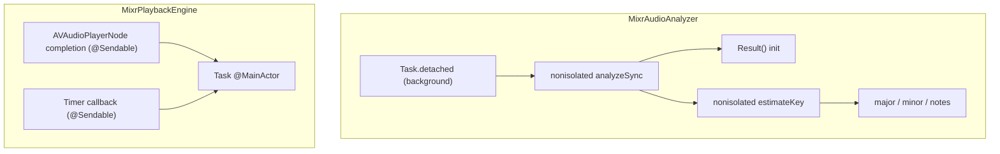

# Fix MixrAudioAnalyzer and MixrPlaybackEngine Build Warnings

## What the build reports

A clean build surfaces **6 warnings**, all related to Swift concurrency under the project setting `SWIFT_DEFAULT_ACTOR_ISOLATION = MainActor` (in [`Mixr.xcodeproj/project.pbxproj`](Mixr.xcodeproj/project.pbxproj)):

| File | Line | Warning |
|------|------|---------|
| [`Mixr/Models/MixrAudioAnalyzer.swift`](Mixr/Models/MixrAudioAnalyzer.swift) | 28 | `Result()` init is `@MainActor`-isolated, called from `nonisolated analyzeSync` |
| [`Mixr/Models/MixrAudioAnalyzer.swift`](Mixr/Models/MixrAudioAnalyzer.swift) | 156 | `major`, `minor`, `notes` are `@MainActor`-isolated, referenced from `nonisolated estimateKey` |
| [`Mixr/Models/MixrPlaybackEngine.swift`](Mixr/Models/MixrPlaybackEngine.swift) | 196 | Captured `self` referenced inside concurrent `Task` (segment completion handler) |
| [`Mixr/Models/MixrPlaybackEngine.swift`](Mixr/Models/MixrPlaybackEngine.swift) | 239 | Captured `self` referenced inside concurrent `Task` (timer callback) |

These are **warnings today** but become **errors in Swift 6 language mode** — worth fixing now.



---

## Fix 1: MixrAudioAnalyzer — actor isolation on `Result` and lookup tables

**Problem:** Most analyzer methods were marked `nonisolated`, but nested `Result` and the Krumhansl lookup arrays still inherit default `@MainActor` isolation.

**Fix in [`Mixr/Models/MixrAudioAnalyzer.swift`](Mixr/Models/MixrAudioAnalyzer.swift):**

1. Mark `Result` as `Sendable` and give it an explicit `nonisolated init(...)` so `return Result()` inside `analyzeSync` is valid from a background thread.
2. Mark the three static lookup properties as `nonisolated`:

```swift
struct Result: Sendable { ... }

nonisolated private static let major: [Double] = [...]
nonisolated private static let minor: [Double] = [...]
nonisolated private static let notes: [String] = [...]
```

**No algorithm changes.** BPM/key analysis logic stays identical.

---

## Fix 2: MixrPlaybackEngine — safe `self` capture in async callbacks

**Problem:** Both callbacks use `[weak self]` in the outer closure, then reference `self?` inside a nested `Task { @MainActor in ... }`. Swift treats the weak-captured `self` as a mutable variable and warns when it is read from concurrent code.

**Current pattern (lines 195–197 and 238–240):**

```swift
) { [weak self] in
    Task { @MainActor in self?.onSegmentEnd(trackID: track.id) }
}

ticker = Timer.scheduledTimer(...) { [weak self] _ in
    Task { @MainActor in self?.tick() }
}
```

**Fix in [`Mixr/Models/MixrPlaybackEngine.swift`](Mixr/Models/MixrPlaybackEngine.swift):**

Move `self` capture into the `Task`'s own capture list (and hoist `track.id` before the callback):

```swift
let trackID = track.id
p.node.scheduleSegment(...) { [weak self] in
    Task { @MainActor [weak self] in
        self?.onSegmentEnd(trackID: trackID)
    }
}

ticker = Timer.scheduledTimer(...) { [weak self] _ in
    Task { @MainActor [weak self] in
        self?.tick()
    }
}
```

**No playback behavior changes.** Still hops to `@MainActor` before touching engine state; still uses weak references to avoid retain cycles.

---

## Optional micro-cleanup (same PR, zero behavior impact)

- `onSegmentEnd(trackID:)` accepts `trackID` but never uses it (line 222). Either remove the unused parameter or prefix with `_` to silence a potential future unused-parameter warning. Only do this if you want zero dead API surface; it is not required to fix the current 6 warnings.

---

## Verification

After changes, run:

```bash
xcodebuild -scheme Mixr -destination 'generic/platform=iOS' build
```

Confirm **zero warnings** referencing:
- `MixrAudioAnalyzer.swift`
- `MixrPlaybackEngine.swift`

Manual smoke test (unchanged behavior):
- Import a track, play/pause, scrub playhead, seek — playback and analysis should behave exactly as before.

---

## Scope guardrails (per your request)

- **Do not** change design system, UI, or audio algorithms
- **Do not** refactor playback architecture
- **Only** concurrency annotations and closure capture lists
