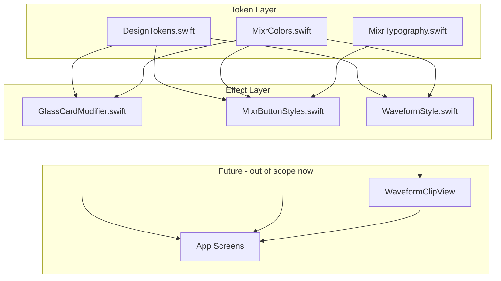
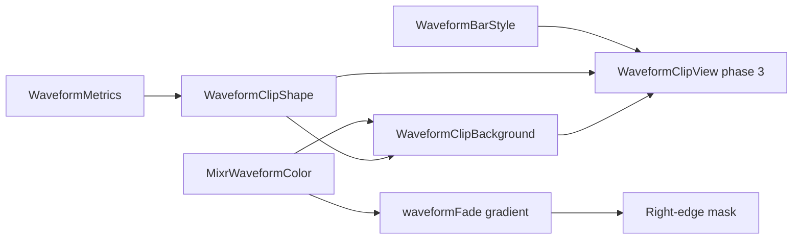

# Mixr Design System Plan

Scope: **visual foundation only** — static tokens, modifiers, button styles, and waveform *styling primitives* (metrics, colors, fade, capsule shape). No app screens, no MVVM, no audio/import/export/AI.

---

## 1. Design System Architecture



**Principles**

- **Single source of truth per concern**: numeric/layout constants in `DesignTokens`; semantic colors + gradients in `MixrColors`; text scale in `MixrTypography`.
- **Composable, not monolithic**: glass is a `ViewModifier`; buttons are `ButtonStyle` conformances; waveform styling exposes metrics + `Shape` + gradient helpers — not a timeline view.
- **Screenshot fidelity over abstraction**: token values match the design plan image and reference UI; semantic naming (`MixrColors.textSecondary`) avoids hard-coded hex in screens later.
- **iOS 18+ SwiftUI native**: system fonts, `Material`, `LinearGradient`/`RadialGradient`, `ButtonStyle`, `ViewModifier` — no third-party dependencies.

**Token reconciliation note**: The design plan image, workspace rules, and screenshot descriptions disagree slightly on waveform pink (`#FE5FA2` / `#FF5FA2` / `#FF2D55`). Plan adopts **`#FF5FA2`** from [`.cursor/rules/mixr.mdc`](.cursor/rules/mixr.mdc) as canonical; pink glow in the design plan (`rgba(255, 95, 162, 0.20)`) aligns with that value. Final pixel-match against the saved reference at [`assets/iphone_1-…png`](assets/) during implementation.

---

## 2. File Structure

```
Mixr/
└── DesignSystem/
    ├── DesignTokens.swift          # spacing, radii, shadows, glows, waveform metrics
    ├── MixrColors.swift            # semantic colors, hex helper, gradient presets
    ├── MixrTypography.swift        # text style enum + font modifier
    ├── GlassCardModifier.swift     # glass material ViewModifier
    ├── MixrButtonStyles.swift      # 5 ButtonStyle types (NEW — see rationale below)
    └── WaveformStyle.swift         # waveform colors, capsule shape, fade (NEW)
```

All files are **internal to the app target** (no separate Swift Package yet). A single `DesignSystem/` group keeps the foundation isolated from future `Features/` and `App/` code.

### Why two additional files beyond the proposed four

| File | Why needed |
|------|------------|
| [`MixrButtonStyles.swift`](Mixr/DesignSystem/MixrButtonStyles.swift) | Section 6 defines **five distinct button variants** (primary gradient, secondary glass, solid icon, glass icon, S/M toggle). Each requires a `ButtonStyle` conformance with layout, padding, and material/gradient wiring. Putting these in `GlassCardModifier` or `DesignTokens` would violate single-responsibility and make buttons harder to preview/test in isolation. |
| [`WaveformStyle.swift`](Mixr/DesignSystem/WaveformStyle.swift) | Section 7 is more than color tokens: it needs a **pointed capsule tail shape**, clip vs waveform opacity split (0.55 / 1.0), and a horizontal fade gradient (85% → transparent). These are rendering primitives, not general design tokens. The actual `WaveformClipView` (mock amplitude bars) is **phase 3** per build order — this file only holds styling infrastructure. |

Gradients and shadows stay **inside existing files** (`MixrColors` for gradients; `DesignTokens` for shadow/glow structs) to avoid file sprawl.

---

## 3. Design Token Specification

### 3.1 Color Tokens — [`MixrColors.swift`](Mixr/DesignSystem/MixrColors.swift)

| Token | Hex / Value | Usage in reference |
|-------|-------------|-------------------|
| `background` | `#050816` | Deepest canvas |
| `backgroundSecondary` | `#080B16` | Secondary panels |
| `surface` | `#111827` | Glass tint base |
| `elevatedSurface` | `#171E2E` | Elevated glass tint |
| `textPrimary` | `#FFFFFF` | Titles, active labels |
| `textSecondary` | `#9CA3AF` | Artist, BPM, ruler labels |
| `textTertiary` | `#6B7280` | Inactive/disabled |
| `textMuted` | `#E5E7EB` | Light neutral (plan image) |
| `divider` | `#2A3142` | Grid lines, separators |
| `primaryPurple` | `#8B5CF6` | Logo accent, play, AI button |
| `secondaryPurple` | `#A78BFA` | Gradient start |
| `waveformPink` | `#FF5FA2` | Blinding Lights track |
| `waveformPurple` | `#A855F7` | Levitating track |
| `waveformRed` | `#EF4444` | Good 4 U track |
| `waveformYellow` | `#EAB308` | Stay track |
| `waveformBlue` | `#0EA5E9` | Heat Waves track |

**Public API**

- `Color` hex initializer: `Color(hex: "050816")`
- Static semantic colors: `MixrColors.background`, `.textPrimary`, etc.
- `enum MixrWaveformColor: CaseIterable` — maps track index → color + glow color
- Gradient presets (see §3.5)

**Dependencies**: `SwiftUI` only

---

### 3.2 Typography Tokens — [`MixrTypography.swift`](Mixr/DesignSystem/MixrTypography.swift)

| Style | Font | Size | Weight | Line Height | Reference usage |
|-------|------|------|--------|-------------|-----------------|
| `displayLogo` | SF Pro Display (`.system`) | 24 | semibold | 28 | "Mixr" logo |
| `sectionTitle` | SF Pro Display | 15 | semibold | 18 | "Effects", section headers |
| `songTitle` | SF Pro Text | 13 | semibold | 16 | Track names in sidebar |
| `body` | SF Pro Text | 12 | regular | 16 | General copy |
| `metadata` | SF Pro Text | 10 | medium | 14 | Artist, duration, BPM |
| `button` | SF Pro Text | 12 | medium | 16 | Import, Export, Mixer |
| `caption` | SF Pro Text | 9 | regular | 12 | Ruler ticks, fine labels |
| `timecode` | SF Pro Text (monospaced digit) | 12 | medium | 16 | `01:24 / 03:45` |

**Public API**

- `enum MixrTextStyle` — cases above
- `extension Font { static func mixr(_ style: MixrTextStyle) -> Font }`
- `struct MixrFontModifier: ViewModifier` + `View.mixrFont(_:)` convenience
- Optional: `lineSpacing` computed per style to approximate specified line heights

**Dependencies**: `SwiftUI`

**Dynamic Type**: use relative sizes where possible (`Font.system(size:weight:design:)` with `@ScaledMetric` deferred to screen phase; tokens define base point sizes from design plan).

---

### 3.3 Spacing, Radii, Layout — [`DesignTokens.swift`](Mixr/DesignSystem/DesignTokens.swift)

**Spacing** (derived from screenshot density; refine during layout phase):

| Token | Value | Notes |
|-------|-------|-------|
| `xxs` | 2 | Tight inner gaps |
| `xs` | 4 | Icon padding |
| `sm` | 8 | Waveform inner padding, compact gaps |
| `md` | 12 | Standard panel padding |
| `lg` | 16 | Glass corner radius unit, section gaps |
| `xl` | 24 | Major section separation |

**Corner radii**:

| Token | Value | Used by |
|-------|-------|---------|
| `radiusGlass` | 16 | Sidebar, effects drawer, panels |
| `radiusButton` | 12 | Primary/secondary text buttons |
| `radiusIcon` | 20 | 40×40 circular icon buttons |
| `radiusToggle` | 16 | Solo/Mute 32×40 toggles |
| `radiusWaveform` | 10 | Waveform clip capsule |

**Button dimensions** (from design plan):

| Token | Value |
|-------|-------|
| `buttonPaddingH` | 16 |
| `buttonPaddingV` | 10 |
| `iconButtonSize` | 40 |
| `toggleButtonWidth` | 32 |
| `toggleButtonHeight` | 40 |

**Public API**

- `enum MixrSpacing` / `CGFloat` static constants
- `enum MixrRadius`
- `enum MixrLayout` (button/icon sizes)
- `struct MixrShadow` — `.subtle`, `.medium`, `.large` with `radius`, `x`, `y`, `Color`
- `struct MixrGlow` — `.purplePrimary`, `.purpleStrong`, `.pinkWaveform`
- View extension: `func mixrShadow(_: MixrShadow)` and `func mixrGlow(_: MixrGlow)`

**Dependencies**: `SwiftUI`

---

### 3.4 Shadows — in [`DesignTokens.swift`](Mixr/DesignSystem/DesignTokens.swift)

| Token | X | Y | Blur | Color |
|-------|---|---|------|-------|
| `shadowSubtle` | 0 | 1 | 2 | `black @ 0.25` |
| `shadowMedium` | 0 | 4 | 12 | `black @ 0.35` |
| `shadowLarge` | 0 | 8 | 24 | `black @ 0.45` |

| Glow | X | Y | Blur | Color |
|------|---|---|------|-------|
| `glowPurplePrimary` | 0 | 0 | 30 | `#8B5CF6 @ 0.20` |
| `glowPurpleStrong` | 0 | 0 | 60 | `#8B5CF6 @ 0.35` |
| `glowPinkWaveform` | 0 | 0 | 30 | `#FF5FA2 @ 0.20` |

Implementation: layered shadows via `.shadow()` (SwiftUI supports multiple). Glows applied sparingly — effect card icons, play button, waveform clips — per reference restraint.

---

### 3.5 Gradients — in [`MixrColors.swift`](Mixr/DesignSystem/MixrColors.swift)

| Token | Definition | Usage |
|-------|------------|-------|
| `backgroundLinear` | 180°, `#0B0B16` → `#050816` | Root canvas |
| `backgroundRadial` | center ~(20%, -10%), 1200×600pt ellipse, `#8B5CF6 @ 0.15` → transparent @ 60% | Purple ambient wash top-left |
| `accentLinear` | 135°, `#A78BFA` → `#8B5CF6` | Play button, AI Suggestions |
| `waveformFade` | 90°, track color @ 0% → @ 85% → transparent @ 100% | Clip right-edge fade handle |

**Public API**

- `static var MixrGradients.backgroundLinear: LinearGradient` (namespace enum or nested struct)
- `func MixrGradients.waveformFade(for color: Color) -> LinearGradient`

**Dependencies**: `MixrColors` semantic colors

---

### 3.6 Button Styles — [`MixrButtonStyles.swift`](Mixr/DesignSystem/MixrButtonStyles.swift)

| Style | Fill | Text/Icon | Border | Radius | Size |
|-------|------|-----------|--------|--------|------|
| `MixrPrimaryButtonStyle` | `accentLinear` gradient | white, `.button` font | none | 12 | padding 10×16 |
| `MixrSecondaryGlassButtonStyle` | glass default | white, `.button` font | white @ 0.08, 1pt | 12 | padding 10×16 |
| `MixrIconButtonStyle` | solid `primaryPurple` | white SF Symbol | none | 20 (circle) | 40×40 |
| `MixrIconGlassButtonStyle` | glass default | white SF Symbol | glass border | 20 | 40×40 |
| `MixrToggleButtonStyle` | glass default | white "S"/"M", `.caption` | glass border | 16 | 32×40 |

**Public API**

- Five `struct …: ButtonStyle` types
- `extension ButtonStyle where Self == MixrPrimaryButtonStyle { static var mixrPrimary: … }` for ergonomic `.buttonStyle(.mixrPrimary)`

**Dependencies**: `DesignTokens`, `MixrColors`, `MixrTypography`, `GlassCardModifier` (secondary/toggle/icon-glass reuse glass background helper)

---

### 3.7 Waveform Styling System — [`WaveformStyle.swift`](Mixr/DesignSystem/WaveformStyle.swift)

Visual spec from design plan + reference screenshot:

| Property | Value |
|----------|-------|
| Clip height | 48 pt |
| Corner radius | 10 pt |
| Inner padding | 8 pt |
| Clip background opacity | 0.55 (tinted glass capsule) |
| Waveform fill opacity | 1.0 |
| Right-edge fade | last 15% of clip width, gradient to transparent |
| Tail shape | Pointed triangular extension on right edge of capsule (screenshot) |

**Public API**

- `struct WaveformMetrics` — static constants (or reads from `DesignTokens`)
- `enum MixrWaveformColor` — re-export or alias from `MixrColors`
- `struct WaveformClipShape: Shape` — rounded rect + pointed tail path
- `struct WaveformClipBackground: View` — tinted glass fill at 0.55 opacity + border (track-color tint @ low opacity)
- `func waveformFadeMask(width: CGFloat) -> LinearGradient` — horizontal fade overlay
- `struct WaveformBarStyle` — bar width (~2pt), min height, vertical gradient (lighter center — screenshot detail)

**Out of scope in this file**: mock amplitude data generation, timeline layout, playhead — those belong to `WaveformClipView` (phase 3).

**Dependencies**: `DesignTokens`, `MixrColors`, `GlassCardModifier`

---

## 4. Glass Material Strategy

[`GlassCardModifier.swift`](Mixr/DesignSystem/GlassCardModifier.swift) implements three tiers matching the design plan:

| Level | Background overlay | Border | Blur |
|-------|-------------------|--------|------|
| `default` | `#111827 @ 0.55` | white @ 0.08 | `.ultraThinMaterial` + visual blur ≈ 24pt |
| `elevated` | `#171E2E @ 0.65` | white @ 0.10 | same |
| `strong` | `#171E2E @ 0.75` | white @ 0.12 | same |

**Implementation approach**

```swift
// Conceptual layering (bottom → top):
// 1. Material.ultraThinMaterial (system blur)
// 2. Color overlay at tier opacity
// 3. 1pt stroke border (RoundedRectangle stroke)
// 4. Optional subtle inner highlight (white @ ~0.04, top edge only — if needed for fidelity)
```

**Public API**

- `enum GlassLevel { case `default`, elevated, strong }`
- `struct GlassCardModifier: ViewModifier` — params: `level`, `cornerRadius` (default 16)
- `extension View { func glassCard(_ level: GlassLevel = .default, cornerRadius: CGFloat = MixrRadius.glass) -> some View }`
- `struct GlassBackground: View` — standalone background for button styles (same layering, no clip)

**Usage mapping** (for later screens, documented now for consistency):

- Sidebar, effects drawer, secondary buttons → `.default`
- Top bar, elevated panels → `.elevated`
- Waveform track row backgrounds → `.strong` or custom tinted variant

**Dependencies**: `DesignTokens`, `MixrColors`

---

## 5. Waveform Rendering Strategy

Phase 1 (this plan) delivers **styling primitives only**:



1. **Capsule container**: `WaveformClipShape` draws rounded rect with pointed tail (Bezier path tuned to screenshot proportions).
2. **Glass tint layer**: track color at ~15–20% opacity over glass strong/default inside the shape.
3. **Amplitude bars** (phase 3): vertical rounded rects, 1–2pt wide, heights from mock `[CGFloat]` array; fill = solid track color with subtle vertical gradient (lighter mid).
4. **Fade handle**: overlay `waveformFade` gradient masked to trailing 15% — simulates clip edge fade in reference.
5. **Glow**: optional `glowPinkWaveform` (or color-matched glow) at low intensity — restrained, not neon.

Mock data and `Canvas`/`Path` drawing for bars are **not** part of this design-system pass.

---

## 6. Risks and Unknowns

| Risk | Impact | Mitigation |
|------|--------|------------|
| **Pink waveform hex mismatch** across spec sources | Wrong track color | Use `#FF5FA2` from rules; verify against reference PNG in Simulator side-by-side |
| **SwiftUI Material vs Figma blur** | Glass may look too light/heavy | Layer explicit color overlay on top of `ultraThinMaterial`; tune opacity on device |
| **Radial gradient "1200×600 at 20% -10%"** | Ambient purple wash position | Approximate with `RadialGradient` + `UnitPoint(x: 0.2, y: -0.1)`; adjust in layout phase |
| **Waveform tail geometry** | Iconic clip shape may need iteration | Implement `WaveformClipShape` as parameterized path; expose tail width/angle constants for tuning |
| **Monospaced timecode** | Ruler alignment | Use `.monospacedDigit()` on iOS 15+ for timecode/caption only |
| **No Xcode project yet** | Files cannot compile until project scaffold exists | Create minimal SwiftUI iOS 18 app target in same PR/step immediately after design system approval (out of scope for this plan but blocking) |
| **Landscape-only layout constants** | Sidebar/timeline proportions unknown at token stage | Defer layout widths to static layout phase; tokens hold spacing/radii only |
| **Dynamic Type scaling** | Dense timeline may break at large accessibility sizes | Design system defines base sizes; screen phase may clamp or use `@ScaledMetric` selectively |

---

## 7. Per-File Summary

### [`DesignTokens.swift`](Mixr/DesignSystem/DesignTokens.swift)
- **Purpose**: Central numeric foundation
- **Responsibilities**: Spacing, radii, button/icon sizes, shadow/glow definitions, waveform metric constants, view shadow/glow extensions
- **Public API**: `MixrSpacing`, `MixrRadius`, `MixrLayout`, `MixrShadow`, `MixrGlow`, `WaveformMetrics`, `View.mixrShadow` / `View.mixrGlow`
- **Dependencies**: SwiftUI

### [`MixrColors.swift`](Mixr/DesignSystem/MixrColors.swift)
- **Purpose**: Semantic color system
- **Responsibilities**: Hex parsing, all color tokens, waveform color enum, gradient presets
- **Public API**: `Color(hex:)`, `MixrColors.*`, `MixrWaveformColor`, `MixrGradients.*`
- **Dependencies**: SwiftUI

### [`MixrTypography.swift`](Mixr/DesignSystem/MixrTypography.swift)
- **Purpose**: Type scale
- **Responsibilities**: Font definitions, text style enum, view modifier
- **Public API**: `MixrTextStyle`, `Font.mixr(_:)`, `View.mixrFont(_:)`
- **Dependencies**: SwiftUI

### [`GlassCardModifier.swift`](Mixr/DesignSystem/GlassCardModifier.swift)
- **Purpose**: Reusable glass surface
- **Responsibilities**: Three-tier material layering, border, corner radius, standalone `GlassBackground`
- **Public API**: `GlassLevel`, `GlassCardModifier`, `GlassBackground`, `View.glassCard(_:cornerRadius:)`
- **Dependencies**: DesignTokens, MixrColors

### [`MixrButtonStyles.swift`](Mixr/DesignSystem/MixrButtonStyles.swift) *(additional)*
- **Purpose**: Interactive control chrome
- **Responsibilities**: Five `ButtonStyle` implementations matching reference
- **Public API**: `MixrPrimaryButtonStyle`, `MixrSecondaryGlassButtonStyle`, `MixrIconButtonStyle`, `MixrIconGlassButtonStyle`, `MixrToggleButtonStyle`, static convenience accessors
- **Dependencies**: DesignTokens, MixrColors, MixrTypography, GlassCardModifier

### [`WaveformStyle.swift`](Mixr/DesignSystem/WaveformStyle.swift) *(additional)*
- **Purpose**: Waveform visual primitives
- **Responsibilities**: Clip shape with tail, tinted background, fade gradient, bar style constants
- **Public API**: `WaveformClipShape`, `WaveformClipBackground`, `WaveformBarStyle`, `waveformFade(for:)`
- **Dependencies**: DesignTokens, MixrColors, GlassCardModifier

---

## 8. Implementation Order (after approval)

1. Scaffold Xcode project (iOS 18, SwiftUI, landscape iPhone) — prerequisite, not design-system code
2. `MixrColors.swift` (hex helper + colors — everything else depends on this)
3. `DesignTokens.swift`
4. `MixrTypography.swift`
5. `GlassCardModifier.swift`
6. `MixrButtonStyles.swift`
7. `WaveformStyle.swift`
8. SwiftUI Preview catalog (`#Preview` blocks in each file) to validate tokens against reference screenshot visually

**No code will be written until you approve this plan.**
